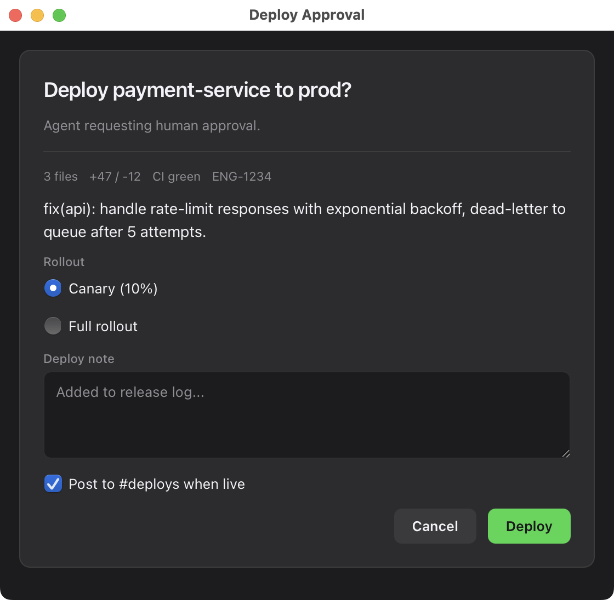
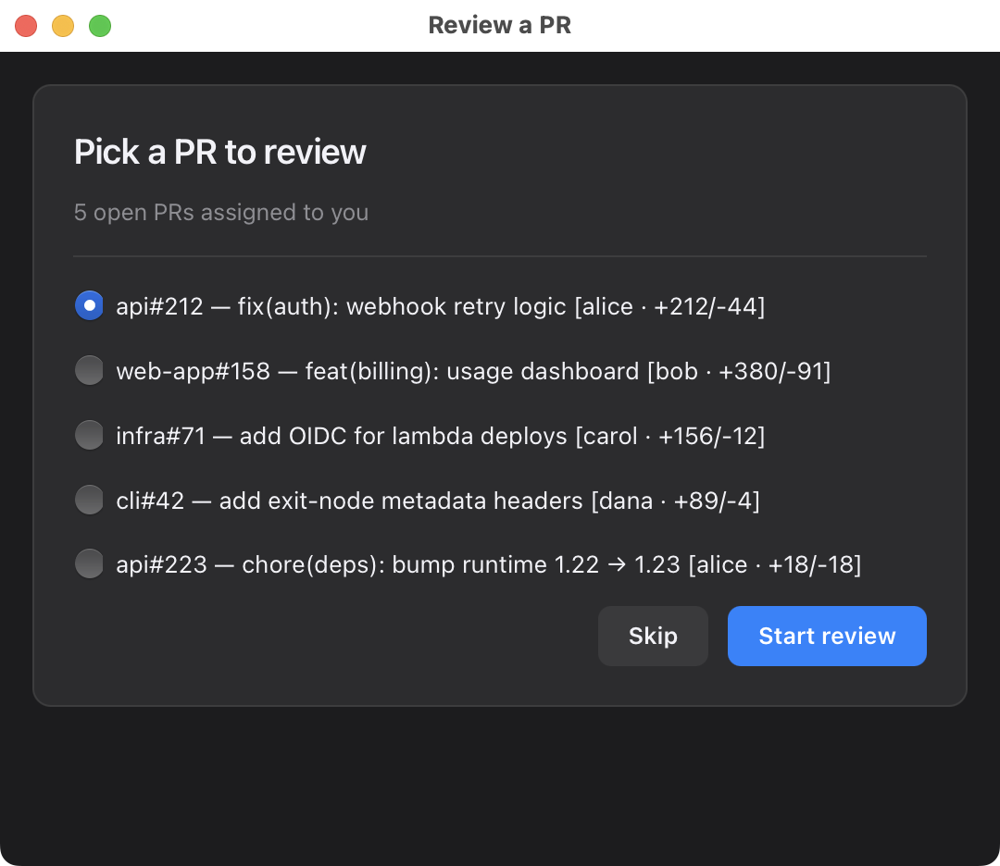
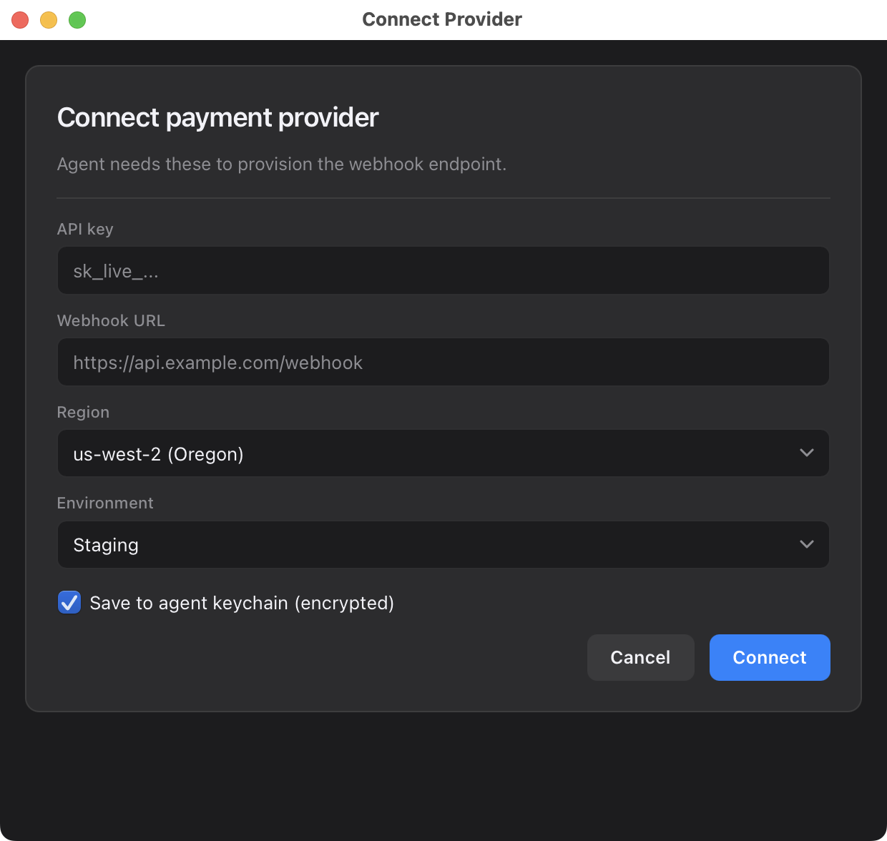
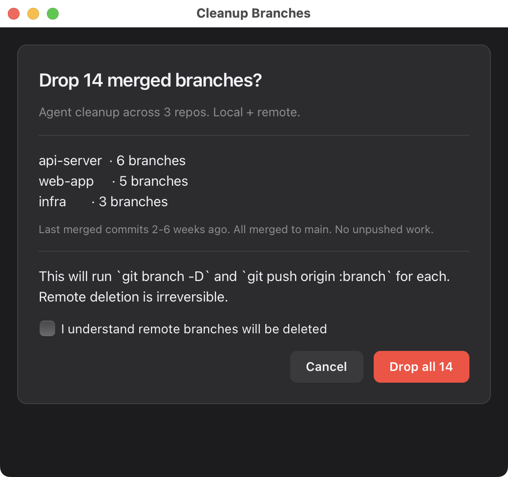
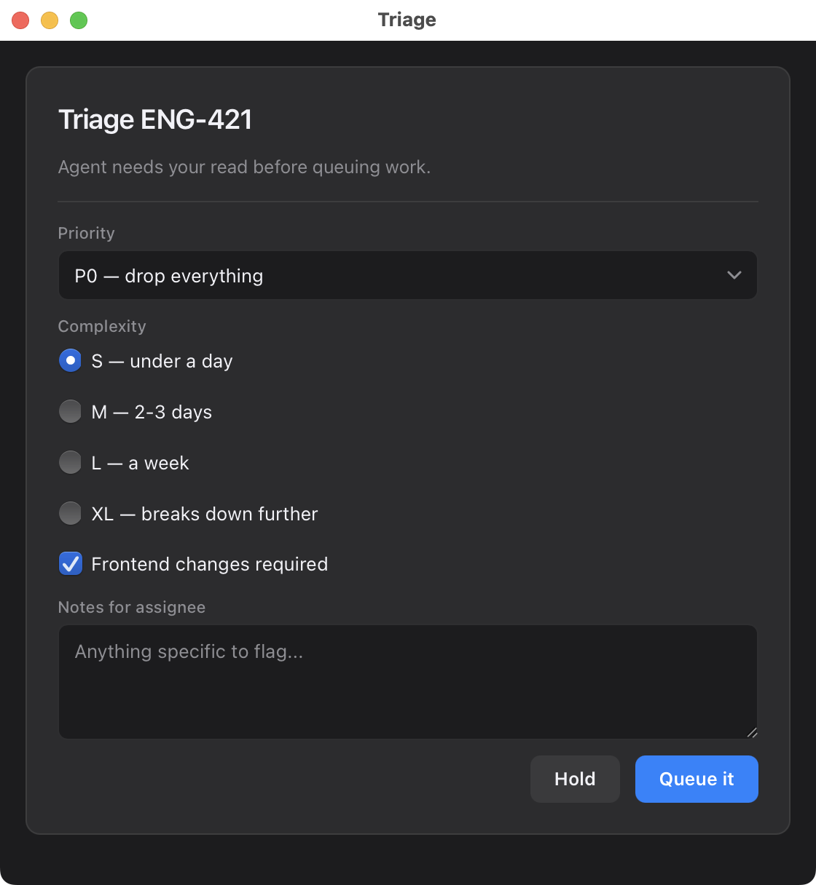

<h1 align="center">webview-cli</h1>
<p align="center">
  <strong>Native macOS UIs for CLI AI agents.</strong><br>
  <sub>193KB · ~180ms cold start · no Electron · no npm · no runtime</sub>
</p>

<p align="center">
  
</p>

<p align="center">
  <a href="https://github.com/giannimassi/webview-cli/actions"></a>
  <a href="LICENSE"></a>
  
  
  
</p>

```bash
curl -sSL https://raw.githubusercontent.com/giannimassi/webview-cli/main/install.sh | bash
```

*One command. Installs the binary via Homebrew, installs the Claude Code skill if `~/.claude` exists, runs a smoke test.*

---

## 193KB vs Electron's 50MB+

Your AI agent needs to ask you a question that doesn't fit in a terminal prompt. The choices today:

- **Electron app:** 50MB+ runtime, 500–800ms cold start, requires a persistent app bundle. Way too heavy for a subprocess the agent spawns 20 times per session.
- **Tauri / Wails:** 8–15MB, 300–500ms. Still too heavy, still designed as app frameworks.
- **`osascript` AppleScript dialog:** built-in, ~300ms, gives you 2 buttons and a text field. Useless for anything structured.
- **Terminal `[y/N]`:** the default. Fine for yes/no, terrible for "review this diff" or "pick one of these 12 PRs."

**webview-cli:** 193KB single binary, ~180ms cold start, a real native macOS window, structured JSON back to the agent, process dies clean.

| | webview-cli | Electron | Tauri / Wails | osascript |
|---|---|---|---|---|
| Binary size | **193KB** | 50MB+ | 8–15MB | built-in |
| Cold start | **~180ms** | 500–800ms | 300–500ms | ~300ms |
| Rich HTML/CSS UI | ✅ | ✅ | ✅ | ❌ |
| Structured JSON out | ✅ | app-specific | app-specific | ❌ (string) |
| Spawnable subprocess | ✅ | ❌ (app lifecycle) | ❌ (app lifecycle) | ✅ |
| Runtime deps | **none** | Electron bundle | WebView2/WebKit2 + Rust | none |
| Agent-first design | ✅ | ❌ | ❌ | ❌ |

## Why it's this small

The numbers aren't optimization magic. They come from not bundling things that were already there.

**WKWebView is already on your Mac.** The same engine Safari uses. We wrap it instead of shipping Chromium. That's ~50MB saved, no install-time download, and a decade of Apple's work on rendering correctness and memory management comes for free.

**The Swift runtime ships with macOS 12+.** `libswiftCore`, `libswiftFoundation`, and friends live on the OS. We don't bundle them, version-pin them, or worry about ABI skew. Another ~12MB avoided, and none of the dylib-shipping pain that usually comes with cross-platform Swift.

**A2UI is declarative, not imperative.** Your agent describes *what* UI it wants in a flat JSONL stream; the renderer decides how to lay it out, handle focus, and collect form data. ~250 lines of vanilla JavaScript covers the entire catalog — no React, no templating engine, no build step.

Each subtraction compounded. Together they produced a binary that starts in ~180ms — faster than Electron finishes parsing its own bootstrap scripts.

## Who it's for

Agent developers on macOS.

Claude Code was macOS-first. Cursor is macOS-first. Codex CLI, ChatGPT Desktop, Raycast, Warp, the wave of indie MCP servers being published on GitHub every week — the people building and using agent workflows skew heavily toward macOS. If you've opened Claude Code recently, you're probably holding a Mac.

macOS-only is a choice, not a gap. A Linux port (GTK + WebKit2) and a Windows port (WebView2) are both technically straightforward, and the protocol is platform-independent — but shipping them at v0.1 would mean three build pipelines, three sets of edge cases, and slower iteration on the platform the audience actually uses. **Depth over breadth.** If you need this on another OS badly enough to maintain a port, open an issue — a clean implementation gets merged.

---

## Use it

### With Claude Code

Install the bundled skill once:

```bash
ln -s "$(pwd)/skill" ~/.claude/skills/webview   # or use the installer flag
```

Then ask your agent anything that needs structured input from you. The skill handles the rest — generates A2UI, spawns the binary, parses the result, returns typed data. You never write JSONL by hand.

**Example: deploy approval.** Agent says:

> "I'm about to deploy `payment-service` to production. Should I proceed?"

The skill opens a native window with the change summary, a rollout radio (canary / full), a comment field, and Approve/Cancel. You click. The agent receives:

```json
{"action": "approve", "data": {"rollout": "canary", "note": "Monitoring on standby"}}
```

and continues. No terminal input. No context loss.

Other patterns the skill handles out of the box: single-select from agent-found options (PRs to review, branches to rebase), multi-field config forms, diff-and-acknowledge flows. Full skill docs: [`skill/SKILL.md`](skill/SKILL.md).

### With OpenAI Codex CLI, Gemini CLI, or any subprocess-capable agent

The binary is protocol-agnostic. Anything that can `spawn_subprocess` and read stdout works:

```python
import subprocess, json

result = subprocess.run(
    ["webview-cli", "--a2ui", "--timeout", "120"],
    input=your_a2ui_jsonl,
    capture_output=True, text=True
)
# result.returncode: 0=submitted, 1=cancelled, 2=timeout, 3=error
# json.loads(result.stdout) has {"status", "data": {"action", "data": {...}}}
```

A complete wrapper plus a Codex tool definition you can paste into your agent config: [`examples/openai-codex-tool.md`](examples/openai-codex-tool.md).

### From a shell script or MCP server

It's a Unix tool. Stdin in, stdout out, exit codes report outcome. Pipes work. Blocking works. Put it wherever a subprocess can run:

```bash
# Approval gate in a CI/deploy script
RESULT=$(cat my-form.jsonl | webview-cli --a2ui --title "Deploy?" --timeout 300)
case $? in
  0) ACTION=$(echo "$RESULT" | jq -r '.data.action'); [ "$ACTION" = "approve" ] && deploy ;;
  1) echo "User cancelled." ;;
  2) echo "Timed out — no response in 5 min." ;;
esac
```

---

## Common patterns

<table>
<tr>
<td width="50%" valign="top">

### Pick from options

Agent enumerates candidates (PRs, branches, files). User picks one with radio buttons. Agent proceeds with the choice.



</td>
<td width="50%" valign="top">

### Multi-field config

Text inputs + selects + checkboxes in one native form. Better than six `read -p` prompts in a row.



</td>
</tr>
<tr>
<td width="50%" valign="top">

### Destructive confirmation

Irreversible action with context, safety checkbox, and a danger-variant button. Prevents the "yes 40 times in a row" mistake.



</td>
<td width="50%" valign="top">

### Triage / classification

Priority dropdown, complexity radio, and notes in one native form. Agent gets structured metadata back to act on.



</td>
</tr>
</table>

<details>
<summary><b>What the raw A2UI JSONL looks like</b> (click to expand — the skill writes this for you)</summary>

```json
{"surfaceUpdate":{"components":[{"id":"root","component":{"Column":{"children":{"explicitList":["card"]}}}}]}}
{"surfaceUpdate":{"components":[{"id":"card","component":{"Card":{"children":{"explicitList":["title","diff","risk","note","btns"]}}}}]}}
{"surfaceUpdate":{"components":[{"id":"title","component":{"Text":{"usageHint":"h2","text":{"literalString":"Deploy payment-service to prod?"}}}}]}}
{"surfaceUpdate":{"components":[{"id":"diff","component":{"Text":{"usageHint":"body","text":{"literalString":"3 files · +47/-12 · CI green · ENG-1234"}}}}]}}
{"surfaceUpdate":{"components":[{"id":"risk","component":{"RadioGroup":{"label":{"literalString":"Rollout"},"fieldName":"rollout","options":[{"value":"canary","label":"Canary (10%)"},{"value":"full","label":"Full rollout"}]}}}]}}
{"surfaceUpdate":{"components":[{"id":"note","component":{"TextInput":{"label":{"literalString":"Deploy note"},"fieldName":"note","multiline":true}}}]}}
{"surfaceUpdate":{"components":[{"id":"btns","component":{"Row":{"alignment":"end","children":{"explicitList":["c","go"]}}}}]}}
{"surfaceUpdate":{"components":[{"id":"c","component":{"Button":{"label":{"literalString":"Cancel"},"variant":"secondary","action":{"name":"cancel"}}}}]}}
{"surfaceUpdate":{"components":[{"id":"go","component":{"Button":{"label":{"literalString":"Deploy"},"variant":"success","action":{"name":"approve"}}}}]}}
{"beginRendering":{"root":"root"}}
```

That's the whole approval UI above. One line per component, flat adjacency list, LLM-friendly to generate. The skill produces this from a short natural-language description of the UI.

</details>

---

## Install

### One command (recommended)

```bash
curl -sSL https://raw.githubusercontent.com/giannimassi/webview-cli/main/install.sh | bash
```

Handles Homebrew tap + formula install + Claude Code skill install + smoke test. Flags:

- `--with-claude-skill` — force skill install even if `~/.claude` not detected
- `--no-claude-skill` — skip skill install

### Homebrew only

```bash
brew tap giannimassi/tap
brew install webview-cli
```

### From source

```bash
git clone https://github.com/giannimassi/webview-cli.git
cd webview-cli
make install   # copies to ~/bin/webview-cli
```

Requires macOS 12+ and the Swift toolchain (Xcode Command Line Tools is enough).

---

## Supported A2UI components

`Text`, `TextInput`, `Button`, `Column`, `Row`, `Card`, `Select`, `Checkbox`, `RadioGroup`, `Image`, `Divider`. Subset of [Google's A2UI v0.8 standard catalog](https://a2ui.org/specification/v0.8-a2ui/).

Full prop reference: [`docs/a2ui-subset.md`](docs/a2ui-subset.md). Protocol reference: [`docs/protocol.md`](docs/protocol.md). Architecture tour: [`docs/architecture.md`](docs/architecture.md).

---

## How it works

One Swift file, ~550 lines. `NSApplication` with `.accessory` policy (no Dock icon), one `NSWindow` with a `WKWebView`, `WKScriptMessageHandler` bridging JS events to stdout, `WKURLSchemeHandler` serving an embedded renderer via `agent://`. Stdin feeds A2UI JSONL into the renderer.

The renderer itself is ~250 lines of vanilla ES — no React, no framework, no build step. It's embedded as a string literal in the Swift binary. "What CSS framework is that?" is a frequent question. The answer is none — system fonts, `-apple-system`, CSS custom properties, ~60 lines of hand-written styles.

See [`docs/architecture.md`](docs/architecture.md) for the tour.

---

## License

MIT — see [LICENSE](LICENSE).

## Credits

- [A2UI](https://a2ui.org/) by Google — the declarative UI spec this renders a subset of
- Opus 4.7 — this tool was built in one evening with Claude Code driving the keyboard. It pairs well with its builder.

---

<p align="center">
  Built by <a href="https://github.com/giannimassi">@giannimassi</a>. If this unblocks one of your agent workflows, <a href="https://github.com/giannimassi/webview-cli">a star</a> is appreciated.
</p>
